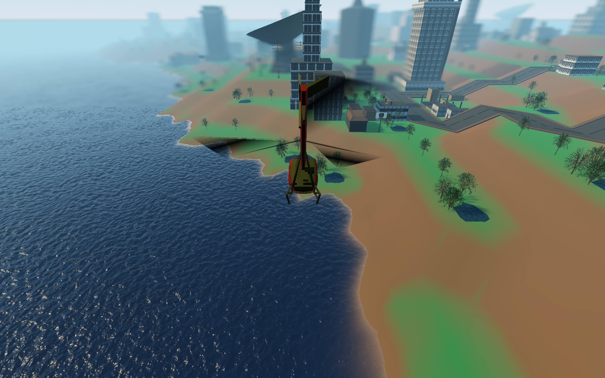
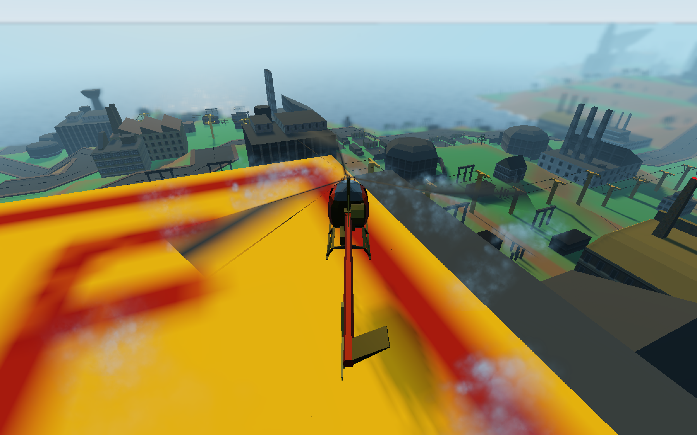

# Sim Chopper

An open source mission driven helicopter pilot sandbox game.

## Controls

| Action                 | Keyboard      |
|------------------------|---------------|
| Lift Up                | Space         |
| Lift Down              | Shift + Space |
| Forward                | W             |
| Backwards              | S             |
| Turn Clockwise         | D             |
| Turn Counter Clockwise | A             |
| Strafe Left            | Shift + A     |
| Strafe Right           | Shift + D     |
| (Water) Canon          | Enter         |
| Quit Game (Windows)    | Alt + F4      |
| Quit Game (macOS)      | Cmd + Q       |
| Quit Game (Linux)      | Ctrl + Q      |

## Screenshots

## Maps

The game uses SimCity 2000 city files to generate its maps. The original city files, created by SC2 have to be converted into a slightly more standardized file format via the sc2mpz tool. Ultimately, it should be possible to load a game with any city built in SimCity 2000.

## Current Features

- Schweizer 300 Helicopter
- Helicopter Takeoff
- Helicopter Air Controls
- Helicopter Ground Proximity Dust
- Ground Collision
- Building Collision
- Helicopter Equipment
  - Water Canon
- Burning Buildings
- Day / Night cycle
- City Traffic

## Planed Features

- Multiple Helicopters
- Funds / Bank Account
- Helicopter Damage
- Helicopter Equipment
  - Megaphone
  - Water Bucket
  - Hoist Line
  - Tear Gass
  - Gun
  - Spot Light
  - Seats
- Third Person Pilot Control on the ground
- City Pedestrians
- City Air Traffic
- Weather
  - Rain
  - Thunder
  - Lightning
  - Fog
  - Snow
  - Wind / Storms
- Natural Disasters
  - Tornados
  - Meteor Showers
  - Tidal Waves
  - Earthquakes
- Missions
  - Rescue Missions
  - Fire Fighting Missions
  - Air Ambulance Missions
  - Police Support Missions
  - Traffic Control Missions
  - Passenger Transportation Missions
  - Anti Riot Missions
  - Military Missions

## Building From Source
The game is built with the [Godot Game Engine 4.2.2](https://github.com/godotengine/godot/tree/4.2.2-stable) and new builds can be exported with the engines own editor. The game relies on a GDNative module written in Rust. The native module has to be built from source before it can be used by the engine. See the [`/native` directory](./native) for detailed instructions.

## Contributing
Pull Requests should always reference existing issues. Please do not submit PRs which have no related issue. To suggest new features, not listed above, or discuss current features / implementations, please use the discussions Section of the repository.

## External References
 - [sc2 file spec](https://github.com/dfloer/SC2k-docs/tree/a47a55ee21b881093123be2394bc0de7bf603560/sc2%20file%20spec.md)
 - [Disc Contents](https://sourceforge.net/p/miscopter/wiki/CDContents/)
 - [Mesh tools and Documentation](https://github.com/CahootsMalone/maxis-mesh-stuff/tree/cebeee7656ec2fc7f3ec925ca0738db904ad540b/)
